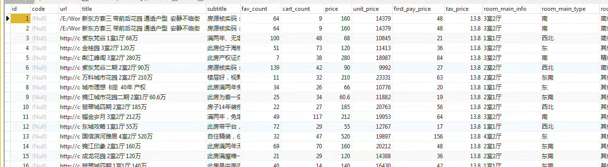

#dacp

## dacp-app-lianjia

成都链家网房产数据爬虫

##dacp-core
自己尝试搭建的框架(未完成)

##dacp-cache

和自己的框架匹配的缓存包(未完成)

## dacp-redis

关于Jedis的学习和使用

## dacp-http

一些关于http,Socket的学习资料(进行中)

## dacp-jetty

jetty学习

## dacp-servlet

关于原生Servlet的日常应用

##dacp-jdbc

jdbc源码学习(未完成)

##dacp-rocketmq

rocketmq学习

##dacp-sources

个人常用的静态资源包,`Bootstrap`,`Jquery`插件

##dacp-wechat

微信公众号开发代码+微信支付

##dacp-demo
个人开发的一些demo级应用

###dacp-map

Servlet+JDBC+BaiDuMap Api

把数据库查询出来的楼盘名加载到百度地图上面;

##dacp-test

乱七八糟测试,没有价值